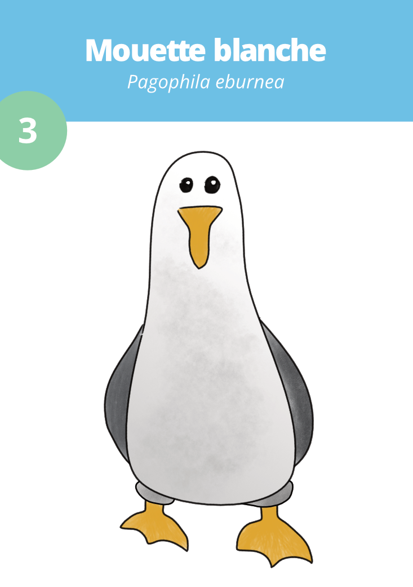
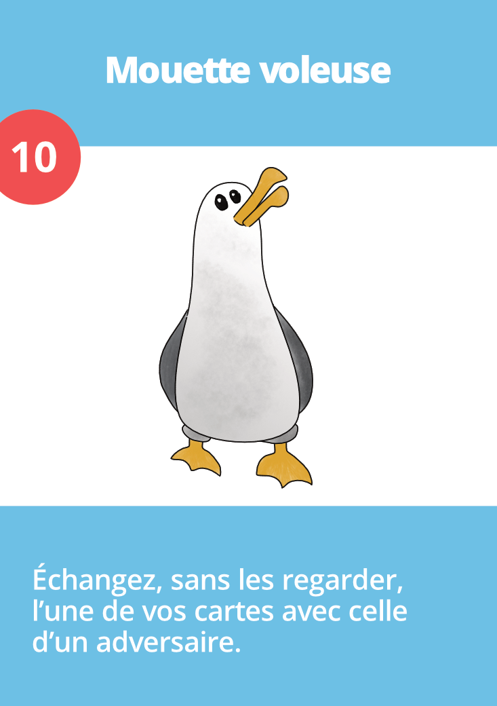

Chaque carte possède une valeur, indiqué dans un cercle de couleur en haut à gauche de la carte. C'est cette valeur
qui est ajoutée au score du joueur à la fin de chaque manche.

Certaines cartes ont également un pouvoir, qui *peut* être utilisé si la carte est défaussée immédiatement après avoir
été piochée. Utiliser le pouvoir d'une carte n'est jamais obligatoire.

